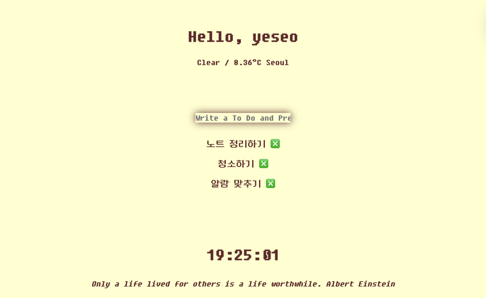

## Overview

크롬 웹사이트 클론 코딩

### Built with
- HTML, CSS, JavaScript
- Local Storage
- Weather API

### The challenge
- 그리팅
  - 로그인하면 이름을 localStorage에 저장하고, 저장된 이름을 기반으로 인사말을 화면에 표시.
  
- to do list
  - 사용자가 입력한 할 일을 localStorage에 저장하고, 저장된 할 일을 화면에 표시하며, 할 일을 추가/삭제 가능.
  
- 날씨 출력
  - weather api를 통해 현재 위치 기반으로 화면에 표시
  
- 시:분:초 형식의 시계 만들기

- 새로 고침할 때마다, 랜덤으로 명언 출력하기

### Reference
<https://nomadcoders.co/javascript-for-beginners>